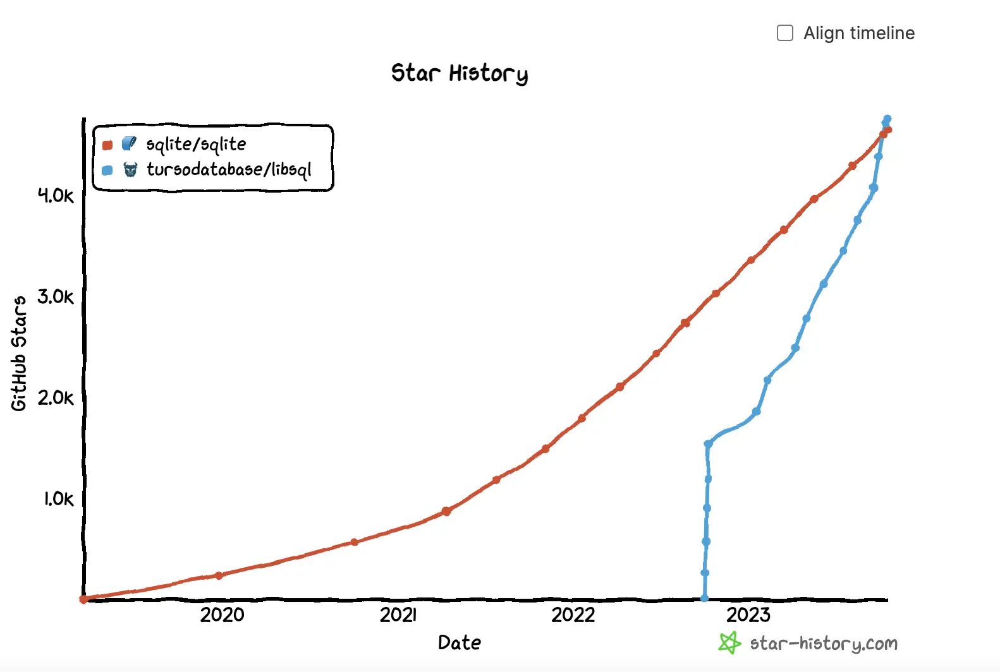

[libSQL](https://turso.tech/libsql) is an Open Source and Open Contribution fork of SQLite.
Unbeknownst to many, SQLite is developed without an OSS license (public domain), with
a small set of developers that very rarely take external contributions. [In their own words](https://sqlite.org/copyright.html), the project is *"Open Source, not Open Contribution"*.


## libSQL

libSQL builds on the solid foundation of SQLite and adds things like:
* [better support for schema changes](https://github.com/tursodatabase/libsql/pull/245),
* [native replication](https://github.com/tursodatabase/libsql/tree/main/libsql-server/proto),
* [HTTP-based protocol for serverless environments](https://github.com/tursodatabase/libsql/tree/main/libsql-server/docs),
* [A server implementation](https://github.com/tursodatabase/libsql/tree/main/libsql-server).
* and automatic [backups to object stores](https://github.com/tursodatabase/libsql/tree/main/bottomless).

libSQL was created and is maintained by the team behind [Turso](https://turso.tech), but it
has a long tail of [contributors](https://github.com/tursodatabase/libsql/graphs/contributors) and is growing
in popularity rapidly:




## Using libSQL

Using libSQL is easy. For example, in TypeScript:

Start by installing the SDK:

```bash
$ npm install @libsql/client
```

then import libSQL:

```typescript
import { createClient } from "@libsql/client";
```

create the client:

```typescript
const client = createClient({
    url: "file:foo.db"
});
```

Alternatively, if are connecting to libsql-server:

```typescript
const client = createClient({
    url: "http://server:port"
    authToken: "token"
});
```

And start issuing queries:

```typescript
try {
    const rs = await client.execute("select * from example_users");
} catch (e) {
    console.error(e);
}
```

# What's coming

We are looking into supporting libSQL in more languages, improving the server memory footprint
and multitenant abilities, and more. Your contribution is welcome!
